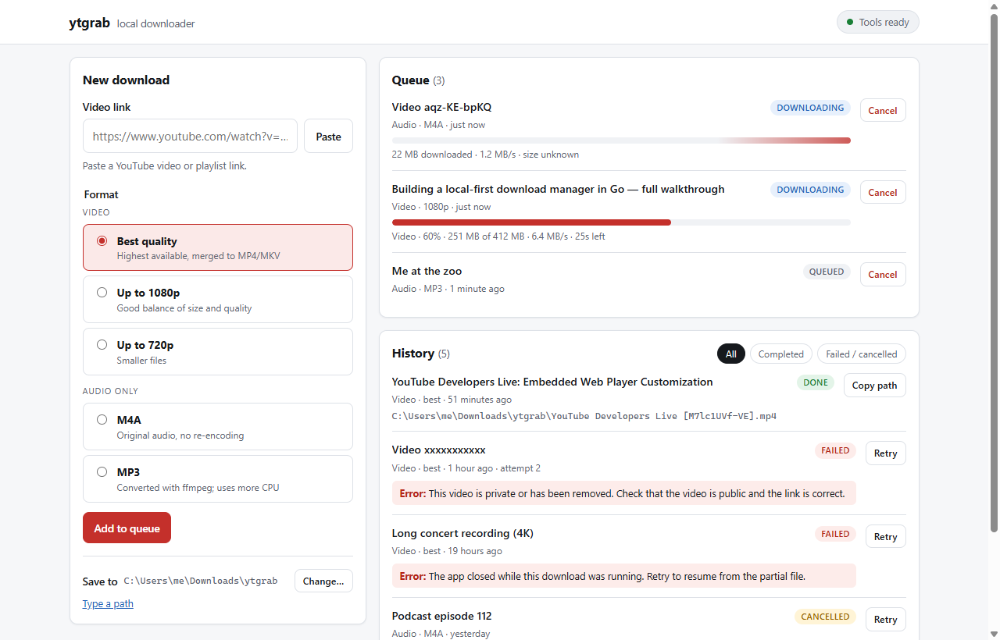

# YTGrab

A local YouTube downloader with a clean browser interface. Paste a link, pick the exact quality you want, and watch it download — everything runs on your own computer.

[](https://github.com/Sanoy24/ytgrab/actions/workflows/ci.yml)
[](go.mod)
[](LICENSE)



## Features

- **Pick the real quality.** Paste a link and choose from the video's actual resolutions and audio streams, with sizes — or use a quick preset (best, 1080p, 720p, M4A, MP3).
- **Playlists, with a review step.** See up to 50 videos, untick what you don't want, and confirm before anything is queued.
- **Live progress.** Speed, size, and time left for every download, updated as it happens.
- **Resume instead of restart.** Cancel, retry, or close the app mid-download — a retry continues from the partial file.
- **Sensible files.** Names include the quality (`Title [id] 1080p.mp4`); H.264 picks are saved as MP4.
- **Easy setup.** `ytgrab setup` installs everything it needs, asking first. `ytgrab doctor` explains what's missing.
- **Private by design.** The server listens only on `127.0.0.1` and keeps history in a local SQLite file. No accounts, no telemetry.

YTGrab is a single Go program. Downloading is done by [yt-dlp](https://github.com/yt-dlp/yt-dlp) and merging by [FFmpeg](https://ffmpeg.org/).

## Getting started

Download the file for your system from [Releases](https://github.com/Sanoy24/ytgrab/releases):

| System | File |
| --- | --- |
| Windows 10/11 (64-bit) | `ytgrab-<version>-windows-amd64.zip` |
| macOS, Apple silicon (M1 and later) | `ytgrab-<version>-darwin-arm64.tar.gz` |
| macOS, Intel | `ytgrab-<version>-darwin-amd64.tar.gz` |
| Linux (64-bit x86) | `ytgrab-<version>-linux-amd64.tar.gz` |

### Windows

1. Right-click the zip → **Extract All…**, into a folder you keep (for example `C:\Apps\YTGrab`).
2. Double-click **Start YTGrab.cmd**. If Windows shows "Windows protected your PC", click **More info → Run anyway** (the app isn't code-signed).
3. The first start checks what's needed and offers to install anything missing — FFmpeg and Deno through `winget` — then opens YTGrab in your browser.
4. Choose a download folder and paste a link.

Next time, just double-click **Start YTGrab.cmd** again.

### macOS

In Terminal (use the `arm64` or `amd64` file you downloaded):

```sh
mkdir -p ~/Applications/YTGrab
tar -xzf ~/Downloads/ytgrab-*-darwin-arm64.tar.gz -C ~/Applications/YTGrab
cd ~/Applications/YTGrab
chmod +x ytgrab
xattr -c ytgrab        # the app isn't signed; this stops macOS blocking it
./ytgrab setup         # installs yt-dlp, plus FFmpeg and Deno with Homebrew
./ytgrab --open        # opens http://127.0.0.1:8787/ in your browser
```

`setup` uses [Homebrew](https://brew.sh) for FFmpeg and Deno; without it, setup tells you what to install. Next time, run `~/Applications/YTGrab/ytgrab --open`.

### Linux

```sh
mkdir -p ~/.local/share/ytgrab
tar -xzf ~/Downloads/ytgrab-*-linux-amd64.tar.gz -C ~/.local/share/ytgrab
cd ~/.local/share/ytgrab
chmod +x ytgrab
./ytgrab setup                        # installs yt-dlp and lists anything else to install
sudo apt install ffmpeg zenity unzip  # Debian/Ubuntu; use dnf or pacman on other distributions
curl -fsSL https://deno.land/install.sh | sh
```

Open a new terminal so Deno is on your `PATH`, then start YTGrab with `~/.local/share/ytgrab/ytgrab --open`. Run `./ytgrab doctor` any time to see what's missing. `zenity` (or `kdialog` on KDE) provides the folder window; without it, you type the folder path instead.

### With Go (any system)

```sh
go install github.com/Sanoy24/ytgrab/cmd/ytgrab@latest
ytgrab setup
ytgrab --open
```

Requires Go 1.25 or newer, with Go's `bin` folder (usually `~/go/bin`) on your `PATH`.

## Usage

| Command | What it does |
| --- | --- |
| `ytgrab --open` | Start the app and open it in your browser |
| `ytgrab doctor` | Check tools, folders, and the port |
| `ytgrab setup` | Install what's missing, asking before each step (`--yes` to accept all) |
| `ytgrab setup --update-ytdlp` | Get the latest yt-dlp — the usual fix when YouTube downloads start failing |
| `ytgrab --version` | Print the version |

Keep the terminal (or console) window open while you use the app; press Ctrl+C to stop it. From a downloaded archive, run the commands from its folder as `./ytgrab …` (Windows: `.\ytgrab.exe …`). See the [user guide](docs/USER_GUIDE.md) for settings, environment variables, and troubleshooting.

## How it works

The browser page talks to a small local server. For each download, the server starts yt-dlp with a fixed list of arguments, reads its progress, and streams it to the page. Jobs and settings live in SQLite, so the queue and history survive restarts. Media goes straight from yt-dlp to your download folder; it never passes through the server or the browser.

More detail: [architecture](docs/ARCHITECTURE.md) · [local API](docs/API.md)

## Development

```sh
go test ./...
go run ./cmd/ytgrab --open
```

See [DEVELOPMENT.md](docs/DEVELOPMENT.md) for previewing the UI with sample data, opt-in integration tests, and building release archives. Issues and pull requests are welcome.

## Responsible use

Only download videos you have the right to save — for example your own uploads, content under a permissive license, or where the platform and copyright holder allow it. You are responsible for complying with YouTube's Terms of Service and the laws that apply to you. YTGrab does not bypass sign-in, DRM, or paywalls.

## Acknowledgements

YTGrab stands on [yt-dlp](https://github.com/yt-dlp/yt-dlp), which does the hard work of talking to YouTube, and [FFmpeg](https://ffmpeg.org/). The job store uses [modernc.org/sqlite](https://gitlab.com/cznic/sqlite).

## License

[MIT](LICENSE) © 2026 Yonas Mekonnen
